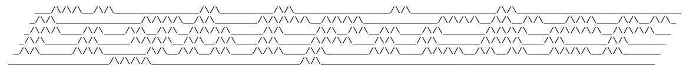

FightPicker is a web application that allows users to make fight picks for MMA bouts. Users can create accounts, join leagues, and compete against friends by predicting the outcomes of upcoming fights.

## Structure
The project uses the service pattern:
    - server: responsible for handling HTTP requests, routing, and middleware.
    - service: contains business logic and orchestrates interactions between repositories and other services.
    - repository: handles data access and persistence, interacting with the database and clients for external services.

## Observability
FightPicker is instrumented with OpenTelemetry for tracing and metrics collection using the LGTM Stack (Alloy, Loki, Grafana, Tempo).

## Code Generation

oapi-codegen is used to generate DTOs and client code from the OpenAPI specification located at `api/swagger.yaml`.
sqlc is used to generate type-safe database access code from SQL schema and query files located in the `db/` directory.

## Local Development

To run FightPicker locally, ensure you have Docker and Docker Compose installed. Then, execute the following command in the project root directory:

```bash
podman-compose down --v && podman-compose up --build
```

run the app in debug mode in your IDE of choice.